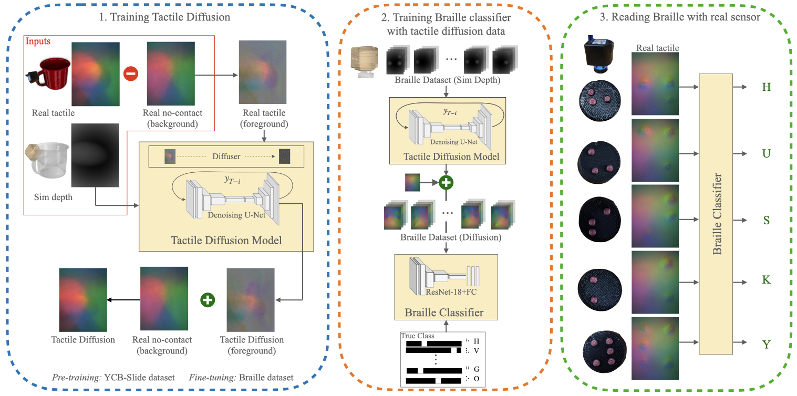

<h1 align="center">Tactile Diffusion</h1>

<p align="center">
    Learning to Read Braille: Bridging the Tactile Reality Gap with Diffusion Models
</p>

<p align="center">
    <a href="https://arxiv.org/abs/2304.01182">Paper</a> |
    <a href="https://youtu.be/U8KD8T3r9eo">Video</a>
</p>

<p align="center">
    
</p>


We present Tactile Diffusion to generate synthetic images for vision-based tactile sensors. Tactile Diffusion can capture the illumination changes due to the elastomer’s deformation in order to close the sim2real gap for vision-based tactile sensing. On real Braille reading task with a DIGIT sensor, a classifier trained with our diffusion model outperforms classifiers trained with simulation and other data adaptation approaches.

<p align="center">

</p>
(Left) Our tactile diffusion model, trained on YCB-Slide and fine-tuned on 20% real braille, learns to generate realistic tactile images from simulated contact depth. (Middle) We train a braille classifier with data generated from tactile diffusion. (Right) On reading real braille with a DIGIT sensor this classifier outperforms classifiers trained with simulation and other approaches.

-----

## Setup

Clone this repo:

```bash
  git clone https://github.com/carolinahiguera/Tactile-Diffusion
  cd Tactile-Diffusion
```

and create virtual environment with the following dependencies:
- numpy
- matplotlib
- torch
- torchmetrics
- sklearn

## Quickstart Demo
Please, run the following scripts for downloading the models, a sample from the YCB-Slide dataset (only one YCB object), and our own Braille dataset.

```bash
  . download_models.sh
  . download_tactile_diffusion_datasets.sh
```

For running a demo of Tactile Diffusion on the YCB-Slide dataset:

```bash
  cd Tactile-Diffusion
  cd tacto_diffusion
  python test_ycb.py
```

For running a demo of Tactile Diffusion on Braille data after fine-tuning:

```bash
  python test_braille.py
```

## Training Tactile Diffusion
For training Tactile Diffusion, we use the [YCB-Slide](https://github.com/rpl-cmu/YCB-Slide) dataset, which provides access to a diversity of contact interactions between a DIGIT sensor and a set of YCB objects. Follow the instructions [here](https://github.com/rpl-cmu/YCB-Slide) to download the real trajectories. Place the dataset in the `datasets` folder. The tree structure of this folder should look like this:

```bash
datasets
├── braille
├── ycb_slide
│   ├── bgs # background images
│   ├── obj_models # mesh file for each YCB object
│   ├── real # dataset of real trajectories with DIGIT sensor
│   │   ├── 021_bleach_cleanser
```

Once the dataset is downloaded, run the following script to generate the depth samples from TACTO simulator in order to train Tactile Diffusion:

```bash
  cd ycb_slide_sim
  . run.sh
```

Run the following script to train Tactile Diffusion with the YCB-Slide dataset:

```bash
  cd ..
  cd tacto_diffusion
  python train_ycb.py
```

To fine-tune Tactile Diffusion with our Braille dataset, run the following script:

```bash
  cd ..
  cd tacto_diffusion
  python train_braille.py
```

## Training Braille Classifier
We train a Braille Classifier with data generated by tacto diffusion. For comparison, we also train the classifier with raw sim data, with the option of fine-tuning the model with real data. To train the classifier, run the following script:

```bash
  cd ..
  cd braille_clf
  python train.py --cfg config/config_tacto.yaml # train with sim data
  python train.py --cfg config/config_tacto_finetune.yaml # train with sim data and fine-tune with real data. You can change the amount of real data used for fine-tuning in the config file (p_data_fine_tune)
  python train.py --cfg config/config_diffusion.yaml # train with data generated by tacto diffusion
```

After training, the script will output metrics such as accuracy, precision, recall when testing the model on real data. The script will also save the model in the `checkpoints` folder.

## Citation

If you find this work useful for your research, please cite our paper:

```
@article{higuera2023learning,
      title={Learning to Read Braille: Bridging the Tactile Reality Gap with Diffusion Models}, 
      author={Carolina Higuera and Byron Boots and Mustafa Mukadam},
      year={2023},
      eprint={2304.01182},
      archivePrefix={arXiv},
}
```
As well as:
```
@inproceedings{suresh2022midastouch,
    title={{M}idas{T}ouch: {M}onte-{C}arlo inference over distributions across sliding touch},
    author={Suresh, Sudharshan and Si, Zilin and Anderson, Stuart and Kaess, Michael and Mukadam, Mustafa},
    booktitle = {Proc. Conf. on Robot Learning, CoRL},
    address = {Auckland, NZ},
    month = dec,
    year = {2022}
}
```

## Acknowledgements
The authors thank Sudharshan Suresh, Mike Lambeta, and Roberto Calandra for help with TACTO simulator and DIGIT sensors.
